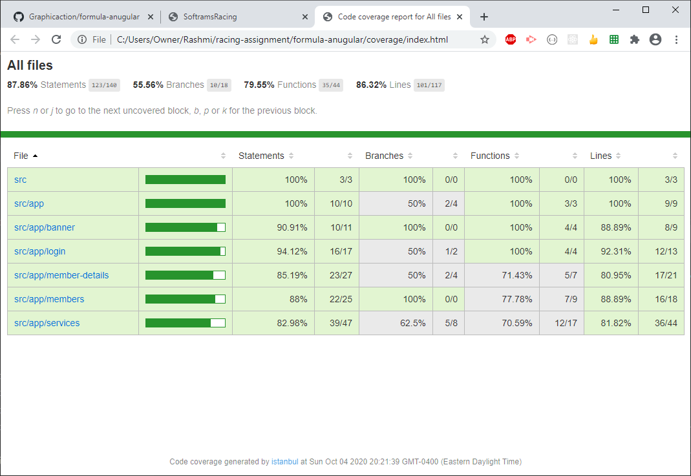
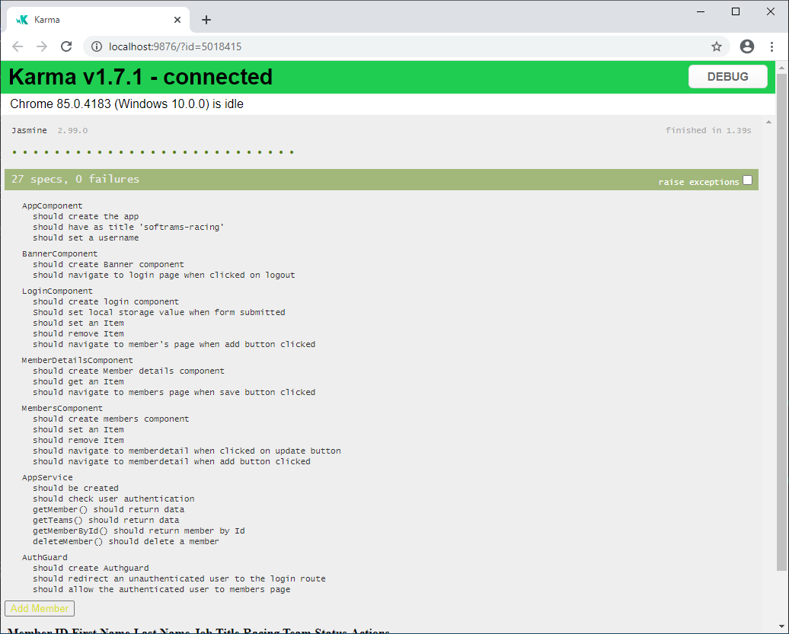
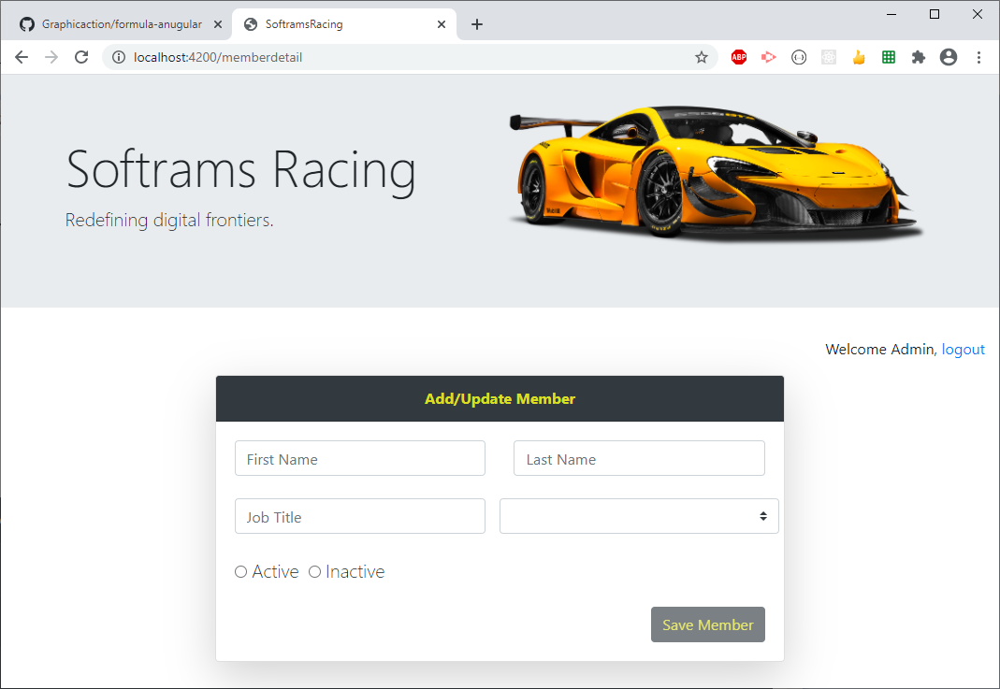
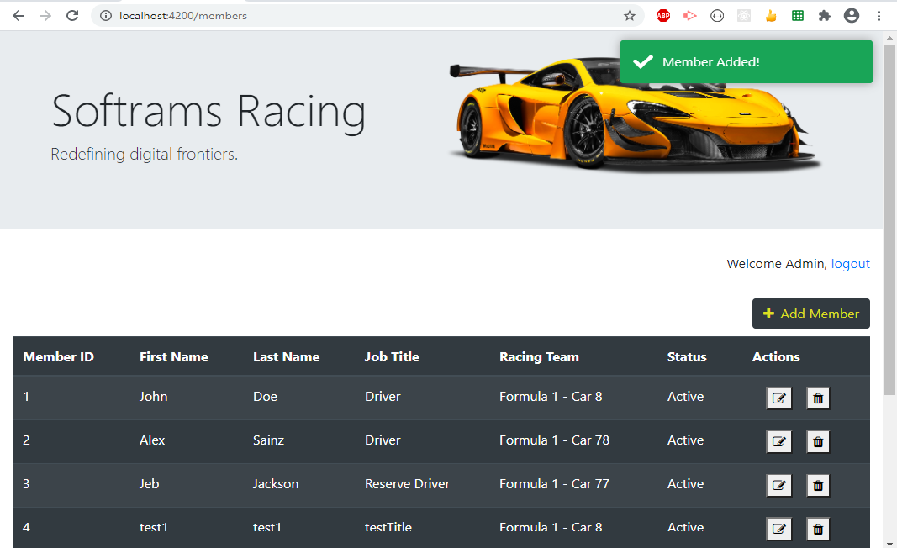
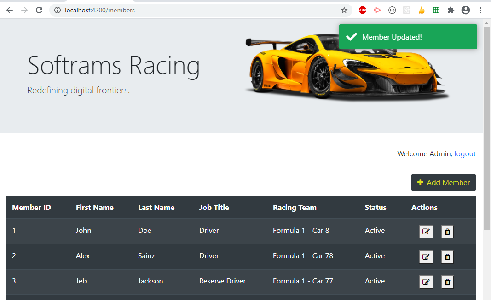
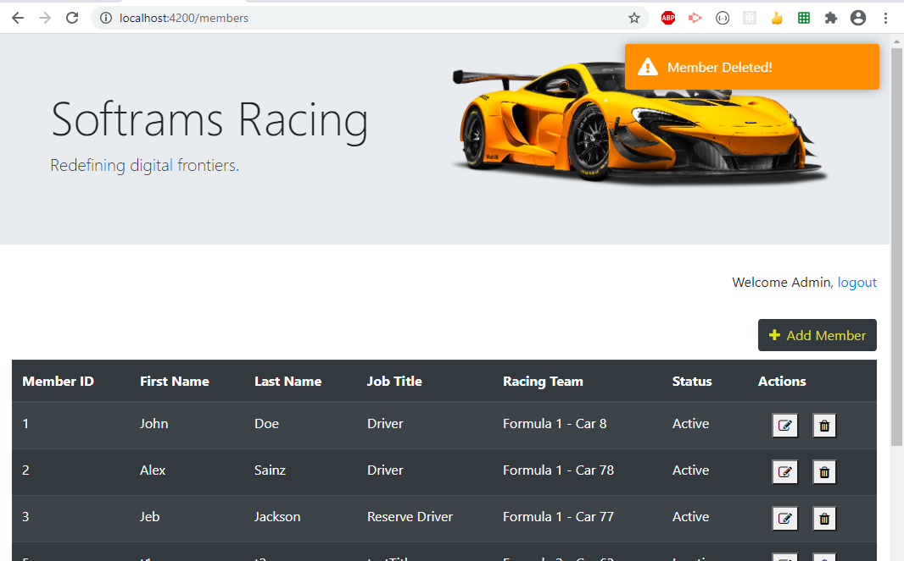
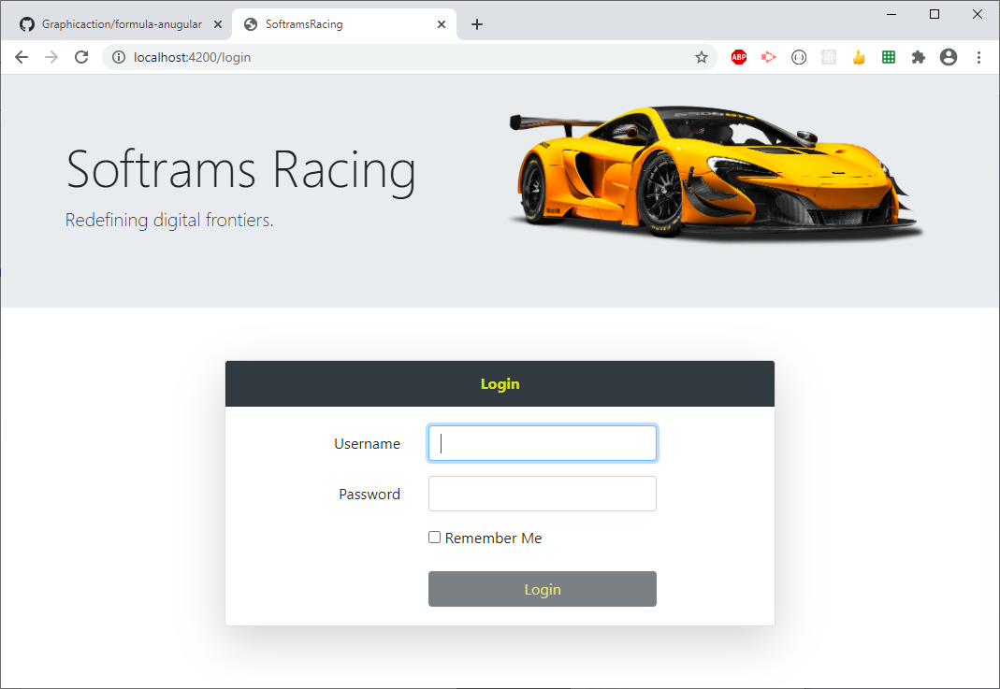

## Requirements

As a user, I need to be able to add a member to the organization so that I can keep track of each team roster.

Member properties

1. First Name
2. Last Name
3. Job Title
4. Status
5. Team

## Development Environment 

* [Express](https://expressjs.com/)
* [Angular CLI](https://cli.angular.io/)
* [json-server](https://github.com/typicode/json-server)
  * A full fake REST API

## Running the Application

Review the available scripts in the [package.json](package.json)   

## Run in Production Mode

Application will run on [localhost:8000](http://localhost:8000)

`npm start`

## Run in Development Mode

Application will run on [localhost:4200](http://localhost:4200)

`npm run start-dev`

_Please Note:  To have Angular call `json-server` directly, set `DEBUG` to `true` in [app.service.ts](./src/app/app.service.ts)_
